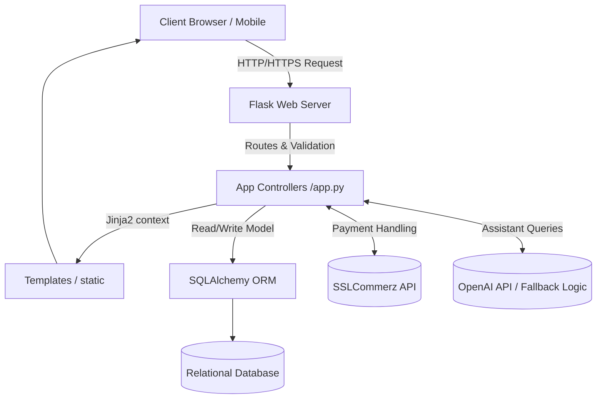
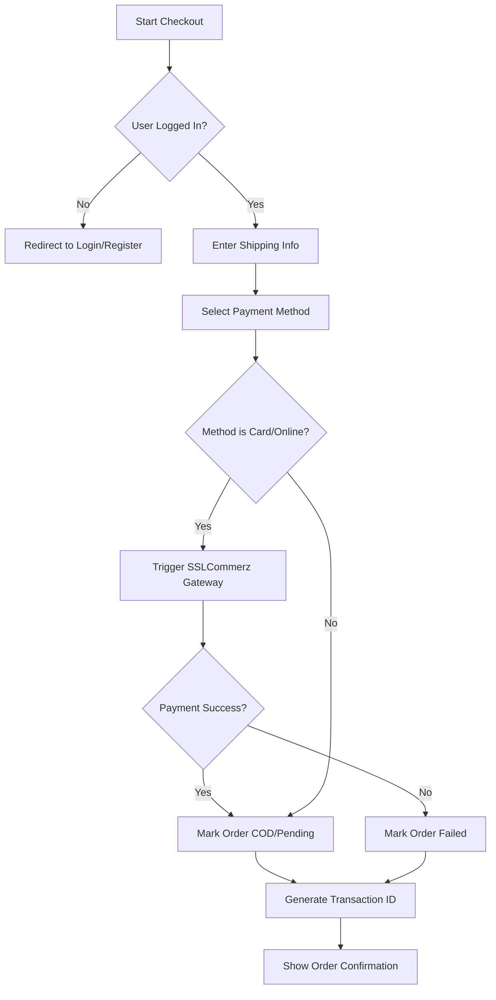

# 1. Executive Summary

Living in an increasingly digital world, consumers demand seamless, unified shopping experiences, yet they often face fragmented marketplaces that lack direct communication with sellers and struggle to highlight sustainable product options. **Lifestyle Mart** addresses this critical pain point by providing a robust, multi-vendor eCommerce platform that seamlessly connects buyers directly with brands, while emphasizing environmentally conscious shopping through its "Green Choice" eco-friendly category. 

Our proposed solution is a centralized Python-based web application that simplifies the user journey from product discovery to secure checkout. The platform's main value proposition lies in its integration of an **AI-powered Shopping Assistant** to guide users, direct vendor-to-consumer messaging, and an integrated payment gateway (SSLCommerz) for frictionless transactions. 

### Technologies Used
* **Backend:** Python 3, Flask framework
* **Database:** SQLAlchemy (ORM), SQLite (Development) / PyMySQL (Production)
* **Frontend:** HTML5, CSS3, Jinja2 templating architecture
* **Integrations:** SSLCommerz gateway, OpenAI API (for the Shopping Assistant)

---

<div style="page-break-after: always;"></div>

## Team Information
*(Note: Please update the placeholders below with the actual photographs and details of your team members)*

| Photograph | Name | Student ID | Specific Role |
| :---: | :--- | :--- | :--- |
|  | **[Team Member 1]** | [ID 1] | Project Manager & Backend Developer |
|  | **[Team Member 2]** | [ID 2] | Frontend Developer & UI/UX |
|  | **[Team Member 3]** | [ID 3] | Database Admin & QA Tester |
|  | **[Team Member 4]** | [ID 4] | AI Integration Specialist |

---

# 2. Introduction

### 2.1 Problem Statement
The current eCommerce landscape often forces consumers to use multiple platforms to fulfill different needs—standard shopping, direct brand interactions, and discovering eco-friendly products. This disjointed, inefficient process makes it difficult for consumers to securely transact, get immediate queries answered, and verify product sustainability. 

### 2.2 Project Objectives
1. **Develop a Multi-Vendor Marketplace:** Create a scalable platform where diverse sellers and official brands can list products.
2. **Promote Sustainability:** Integrate a "Green Choice" feature to filter and spotlight eco-friendly items.
3. **Enhance User Assistance:** Implement an AI Shopping Assistant capable of natural language interaction to answer store policy or product queries.
4. **Ensure Secure Transactions:** Integrate SSLCommerz for reliable localized payment methods (Bank, bKash, Nagad).
5. **Direct Communication:** Provide an in-app messaging system connecting consumers to official brand accounts.

### 2.3 System Boundaries (Scope)
* **In Scope:** User authentication, product catalog management, shopping cart logic, simulated payment processing via gateway, order tracking documentation, role-based dashboards (Admin, Seller, Customer), and automated AI assistance.
* **Out of Scope:** Real-time physical courier tracking integration (via 3rd party logistics APIs), complex ERP/warehouse inventory sync, and multi-currency conversion.

### 2.4 Stakeholder Analysis
* **Admin:** Needs complete oversight of the platform, user roles, product validity, and system configuration.
* **Seller/Brand:** Requires tools to manage product listings, track sales metrics, and communicate directly with inquiring customers.
* **Customer:** Seeks an easy-to-use interface, secure payment methods, rapid AI-driven support, and reliable order tracking.

---

# 3. Requirement Specification

### 3.1 Functional Requirements (FR)

| Requirement ID | Feature Name | Description | Priority | Status |
| :--- | :--- | :--- | :--- | :--- |
| **FR-1** | Account Registration | Users can register as customers, or convert to seller roles. | High | Implemented |
| **FR-2** | Multi-Vendor Product Management | Sellers can add, edit, and delete their products. | High | Implemented |
| **FR-3** | Eco-Friendly Classification | Products can be tagged as "eco-friendly" with specific sustainability descriptions. | High | Implemented |
| **FR-4** | Smart AI Assistant | Chat API to query product availability and store policies. | Medium | Implemented |
| **FR-5** | Direct Messaging | Users can send direct messages to brand/seller specific accounts. | High | Implemented |
| **FR-6** | SSLCommerz Integration | Process payments dynamically with various gateways. | High | Implemented |
| **FR-7** | Order Management | Customers can track estimated delivery and view history. | Medium | Implemented |

### 3.2 Non-Functional Requirements (NFR)
* **Security:** Passwords must be hashed using `werkzeug.security` (bcrypt). Session tokens for all user levels utilizing `Flask-Login`.
* **Scalability:** The application architecture should seamlessly transition from local SQLite to PostgreSQL/MySQL via SQLAlchemy abstraction.
* **Performance:** Initial page loads should occur within 2 seconds. The AI fallback logic must respond within 500ms when standard databases are queried.
* **Usability:** The UI must follow modern, responsive web design principles to work on both mobile and desktop screens.

---

# 4. System Design & Architecture

### 4.1 System Architecture Diagram



### 4.2 System Modeling

**Use Case Diagram**
```mermaid
usecaseDiagram
    actor Customer
    actor Seller
    actor Admin
    
    Customer --> (Browse Products)
    Customer --> (Chat with AI)
    Customer --> (Message Seller)
    Customer --> (Checkout & Pay)
    
    Seller --> (Manage Products)
    Seller --> (View Seller Dashboard)
    Seller --> (Reply to Messages)
    
    Admin --> (Manage All Users)
    Admin --> (System Configurations)
```

**Activity Diagram: The Checkout & Payment Process**


### 4.3 Database Design

**Entity Relationship Diagram (ERD)**
```mermaid
erDiagram
    USERS ||--o{ ORDERS : places
    USERS ||--o{ PRODUCTS : sells
    USERS ||--o{ MESSAGES : sends/receives
    CATEGORIES ||--o{ PRODUCTS : contains
    PRODUCTS ||--o{ ORDER_ITEMS : included_in
    ORDERS ||--|{ ORDER_ITEMS : contains

    USERS {
        int id PK
        string email UK
        string role
        string password_hash
    }
    PRODUCTS {
        int id PK
        int seller_id FK
        string name
        float price
        boolean is_eco_friendly
    }
    ORDERS {
        int id PK
        int user_id FK
        float total_amount
        string status
    }
```

**Data Dictionary (Excerpts)**

| Table | Field | Data Type | Constraint | Description |
| :--- | :--- | :--- | :--- | :--- |
| `users` | `id` | INT | Primary Key | Unique user identifier |
| `users` | `email` | VARCHAR(100) | Unique, Not Null | User's email address |
| `products` | `seller_id` | INT | Foreign Key | Maps to `users.id` |
| `products` | `is_eco_friendly`| BOOLEAN | Default=False | Indicates Green Choice item |
| `orders` | `transaction_id`| VARCHAR(100) | Unique | SSLCommerz Payment Reference |

---

# 5. Technical Implementation 

### 5.1 Backend / Data Interaction Documentation
Instead of a decoupled REST API, Lifestyle Mart uses tightly coupled server-side rendering with Flask and Jinja2. Below is how data is processed in the system.

| HTTP Method | Route Endpoint | Purpose / Data Processing Strategy |
| :--- | :--- | :--- |
| `GET` | `/shop` | Retrieves `Product` data from DB. Applies SQLAlchemy combined filters for category, brand, and `is_eco_friendly` attributes based on URL parameters. |
| `POST` | `/update_profile` | Updates `current_user` object in SQLAlchemy session and commits to DB to mutate user profile info. |
| `POST` | `/send_message` | Inserts a new `Message` object mapping from `current_user.id` to `receiver_id` allowing direct communication. |
| `POST` | `/api/assistant` | JSON endpoint accepting user queries. Processes via intent-based string matching fallback or OpenAI API to respond with matched parameters. |

### 5.2 Role-Based Access Control (RBAC)
Role distinction is handled directly at the database and application route layers. The `users` table holds a `role` ENUM (`user`, `admin`, `seller`). 
* At the code level, custom Python decorators are implemented, such as `@seller_required` and `@admin_required`. 
* When a user visits `/seller/dashboard`, the `@seller_required` wrapper intercepts the request, verifies `current_user.role in ['seller', 'admin']` via Flask-Login, and aborts or redirects unauthorized requests with flash messages.

### 5.3 Frontend Organization
The frontend relies on the Jinja2 templating engine mapped under the `templates/` folder.
* **Layouts:** Features a base `layout.html` that imports shared components like navigation mapping, CSS, and footer layouts.
* **Modularity:** UI logic uses component concepts by extending the base templates (``). For example, seller pages sit cleanly in a `templates/seller/` subdirectory.

---

# 6. User Manual 

### 6.1 Getting Started
1. Access the platform homepage.
2. Click **Login / Register** in the top navigation.
3. Fill in your details (Name, Email, Password).
4. Once authenticated, navigate to the **Profile** dashboard to view past orders or apply as a Seller.

### 6.2 Feature Walkthroughs

*Note: Replace placeholders with screenshots in final submission.*

**Feature: Green Choice (Eco-Friendly Shopping)**
1. **[Screenshot of Shop Filters]**
2. In the "Shop" tab, select the toggle "Eco-Friendly Only".
3. The catalog dynamically refreshes to securely load only highly sustainable products indicating their green footprint.

**Feature: Smart AI Assistant**
1. **[Screenshot of Chat Widget]**
2. Click the floating chat bubble in the bottom right corner.
3. Ask a question such as, "What are your delivery options?" The AI immediately interprets the intent and provides a standard policy response.

---

# 7. Quality Assurance & Testing

### 7.1 Test Case Scenarios

| Test ID | Test Description | Input Data | Expected Result | Actual Result | Status |
| :--- | :--- | :--- | :--- | :--- | :--- |
| TC_01 | User Registration | Email: new@test, Pass: 123 | User record created, redirect to login | Successfully redirected | Pass |
| TC_02 | Eco-Filter Validation | Filter `is_eco_friendly=True` | Only products with eco-status shown | Validated on UI | Pass |
| TC_03 | Payment Gateway Init | valid cart, `payment_method='bkash'`| Redirect to SSLCommerz sandbox | URL generated correctly | Pass |
| TC_04 | AI Fallback Trigger | Query: "How long for delivery" | Responds with standard 3-5 days msg | Appropriate response sent | Pass |

### 7.2 Requirements Traceability Matrix (RTM)

| Req ID | Target Feature | Associated Test Cases |
| :--- | :--- | :--- |
| FR-1 | Registration Logic | TC_01 |
| FR-3 | Eco-Friendly System | TC_02 |
| FR-4 | AI Chat Engine | TC_04 |
| FR-6 | SSLCommerz Checking | TC_03 |

---

# 8. Individual Contribution

*(Note: Each member must customize this section)*

### [Team Member 1 Name]
* **Technical Contribution:** Implemented the core Flask backend routing, database architecture (SQLAlchemy models), and SSLCommerz integration allowing secure checkouts.
* **Technical Challenges:** Managing robust database relationships (such as cascaded deletions for order items) required meticulous planning. Solved database locking issues during test transactions.
* **Learning Outcomes:** Advanced understanding of Python ORMs and state management with third-party payment APIs.

### [Team Member 2 Name]
* **Technical Contribution:** Designed the UI system. Implemented the base layout architecture using Jinja2 and ensured mobile responsiveness.
* **Technical Challenges:** Ensuring the CSS layout appropriately handled dynamic catalog images (resolving broken links) without breaking UI grid frameworks.
* **Learning Outcomes:** Mastered atomic design principles within server-side rendered interfaces.

---

# 9. Conclusion & Future Work

### 9.1 Conclusion
Lifestyle Mart successfully meets the stated objectives of creating a streamlined, multi-vendor electronic marketplace. By resolving the fragmentation between buyers and sellers via integrated communication, offering scalable payment structures, and aggressively pushing the modern "Green Choice" agenda, the project sets a standard for user-centric eCommerce web applications.

### 9.2 Future Enhancements (Version 2.0)
* **Real-Time Delivery API:** Integrating webhook services from local couriers (e.g., Pathao or RedX) for real-time GPS cart tracking.
* **Mobile Application:** Deploying a mirrored React Native application for iOS/Android native performance.
* **Advanced Analytics Server:** Giving Admin and Sellers machine-learning powered dashboards forecasting seasonal demands and trend forecasting.

---

# 10. Appendices

### Appendix A: Repository Info
* **GitHub Repository:** `[Insert GitHub Link here]`
* All continuous integration (CI) tools and main commits can be referenced from the project log in the repository's main branch.

### Appendix B: Installation & Setup Guide (Local)

1. Clone Repository
```bash
git clone [repository url]
cd lifestyle-mart-python
```

2. Setup Virtual Environment
```bash
python -m venv .venv
source .venv/bin/activate  # On Windows: .venv\Scripts\activate
```

3. Install Dependencies
```bash
pip install -r requirements.txt
```

4. Configure Environment
* Create a `.env` file copying structure from `.env.example`. Replace sandbox keys for your specific DB and SSLCommerz credentials.

5. Initialize Database & Run
```bash
python database_setup.py
python seed_eco.py
python app.py
```
*Access platform on http://127.0.0.1:5000*
